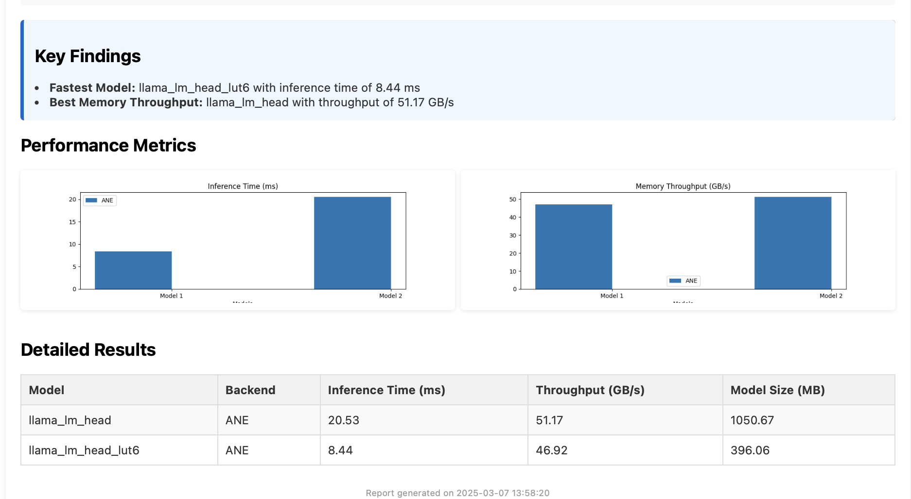

# ANEMLL-Bench

## ⚠️ Attention: macOS 15.x is required! ⚠️

This alpha release requires macOS 15. We plan to update support for older OS versions in the next update.

## 🆕 New: Enhanced Testing for Ultra Models

If you're running on a high-performance Apple chip (Ultra or Pro variants), we strongly recommend running the dual model benchmark to properly evaluate the enhanced ANE capabilities:

```bash

# Update meta.yalm file and download new models
python examples/sync_models.py --update

# For Ultra models (M1/M2/M3 Ultra) and M4 Pro/Max models
python examples/benchmark_dual_models.py --runs 300
```

### Automatic Testing Recommendation

The tool will automatically detect your CPU model and provide testing recommendations:

- If running on **M1/M2/M3 Ultra**: Dual model testing is essential to evaluate the dual ANE clusters
- If running on **M4 Pro/Max**: Dual model testing is recommended to evaluate enhanced ANE performance
- For other models: Standard benchmarking is sufficient, but dual testing provides additional insights

When you run `benchmark_all_models.py`, you'll see a recommendation to run the dual test if your system would benefit from it:

## Overview
ANEMLL-Bench  (pronounced like "animal-bench") is a benchmarking tool specifically designed to measure and evaluate the performance of machine learning models on Apple's Neural Engine (ANE). It provides comprehensive metrics including inference time and memory bandwidth utilization (GB/s) to help researchers and developers optimize their models for Apple Silicon.

This alpha release requires macOS 15. We plan to update support for older OS versions in the next update. Currently, only Memory bandwidth (GB/s) is benchmarked in this release.

ANEMLL-Bench is part on ANEMLL Open Source Project [anemll.com](https://anemll.com)

## 📊 [View Benchmark Results](./Results.MD) 📊

[](./Results.MD)

Check out our latest [benchmark results](./Results.MD) comparing performance across different Apple Silicon chips (M1, M2, M3, M4 series).

<div align="center">
  <h2>📊 Help Us Build a Comprehensive Benchmark Database! 📊</h2>
  <div style="background-color: #f8f9fa; padding: 15px; border-radius: 10px; border-left: 5px solid #007bff; margin: 20px 0; color: #333333;">
    <h3 style="color: #000000;">🚨 PLEASE SUBMIT YOUR BENCHMARK RESULTS FOR: 🚨</h3>
    <table align="center" style="color: #333333;">
      <tr>
        <td align="center"><strong style="color: #000000;">M1 Series</strong></td>
        <td align="center"><strong style="color: #000000;">M2 Series</strong></td>
        <td align="center"><strong style="color: #000000;">M3 Series</strong></td>
        <td align="center"><strong style="color: #000000;">M4 Series</strong></td>
      </tr>
      <tr>
        <td>
          ✓ M1 ✅<br>
          ✓ M1 PRO ✅<br>
          ✓ M1 MAX ✅<br>
          ✓ M1 ULTRA ✅
        </td>
        <td>
          ✓ M2 ✅<br>
          ✓ M2 PRO<br>
          ✓ M2 MAX ✅<br>
          ✓ M2 ULTRA ✅
        </td>
        <td>
          ✓ M3<br>
          ✓ M3 PRO<br>
          ✓ M3 MAX ✅<br>
          ✓ M3 ULTRA
        </td>
        <td>
          ✓ M4 ✅<br>
          ✓ M4 PRO ✅<br>
          ✓ M4 MAX ✅
        </td>
      </tr>
    </table>
    <p style="color: #333333;"><em>📧 Submit results to: <a href="mailto:realanemll@gmail.com" style="color: #0366d6;">realanemll@gmail.com</a> or <a href="https://github.com/Anemll/anemll-bench/issues/new" style="color: #0366d6;">open an issue</a></em></p>
  </div>
</div>



[**Jump to Quick Start →**](#quick-start)

## Compatibility Notice

⚠️ **Important**: This project is designed to work with **Python 3.9-3.11** and has known compatibility issues with Python 3.13+.

### Python Version Compatibility

- **Recommended**: Python 3.9.x
- **Compatible**: Python 3.10-3.12 (may have minor issues)
- **Not Compatible**: Python 3.13+ (has significant compatibility issues with PyTorch 2.5.0)

### PyTorch Version Compatibility

- **Required for ANEMLL**: PyTorch 2.5.0
- **Issue with Python 3.13+**: PyTorch 2.5.0 is not available for Python 3.13+
- **Workaround for Python 3.13+**: Use PyTorch 2.6.0, but expect potential compatibility issues with coremltools

## Requirements

- **macOS with Apple Silicon (ARM64)** - ANE is not available on Intel Macs
- Xcode Command Line Tools installed
- Native ARM64 Homebrew (for installing Python 3.9)

## Quick Start

### ⚠️ Critical: ARM64 Setup Required

**ANE (Apple Neural Engine) is ONLY available on Apple Silicon (ARM64) Macs. You MUST use native ARM64 Python to access ANE hardware.**

#### Option 1: Use Native ARM64 Homebrew (Recommended)

```bash
# Install native ARM64 Python via Homebrew
/opt/homebrew/bin/brew install python@3.9

# Create virtual environment with native Python
/opt/homebrew/opt/python@3.9/bin/python3.9 -m venv env-anemll-bench

source env-anemll-bench/bin/activate

pip install -r requirements.txt
pip install -e .
```

#### Option 2: Use System Python (Already ARM64)

```bash
# Use system Python (already native ARM64)
/usr/bin/python3 -m venv env-anemll-bench

source env-anemll-bench/bin/activate

pip install -r requirements.txt
pip install -e .
```

#### Option 3: Use Setup Script (ARM64-First)

```bash
# Run the ARM64-optimized setup script
./create_python39_env.sh

# Then activate and install dependencies
source env-anemll-bench/bin/activate
cd env-anemll-bench
./install_dependencies.sh
```

**Note**: The setup script now prioritizes native ARM64 Homebrew and will warn you if it detects x86_64 Python on Apple Silicon.

### 🚨 Common Issue: x86_64 Python Under Rosetta

**If you see "ANE Hardware Available: False" in diagnostics, you're using x86_64 Python under Rosetta.**

**Symptoms:**
- `python -c "import platform; print(platform.machine())"` returns `x86_64`
- ANE diagnostic shows "Not running on Apple Silicon (arm64)"
- Models run slowly (CPU-only performance)
- Benchmark times are much slower than expected

**Solution:** Rebuild your environment using one of the ARM64 options above.

**Why this happens:** Even on Apple Silicon Macs, if you install Python via the default Homebrew (which may be x86_64), Python runs under Rosetta translation and cannot access ANE hardware.

### Running Benchmarks

**Important**: ANEMLL-Bench only works with platform-specific ANEMLL models, not generic Hugging Face models.

After setting up with native ARM64 Python:

```bash
# Download all optimized ANEMLL models for your macOS version
python examples/sync_models.py

# Update meta.yaml file and download any missing/new models
python examples/sync_models.py --update

# Benchmark all available ANEMLL models (default behavior)
python examples/benchmark_all_models.py --use-local --no-sync

# Benchmark a specific ANEMLL model (optional)
python examples/benchmark_all_models.py --model llama_lm_head --use-local --no-sync
```

**Available ANEMLL Models:**
- `llama_lm_head` - Llama language model head (ANE-optimized)
- `llama_lm_head_lut6` - Llama model with 6-bit LUT quantization (smaller, faster)
- `DeepHermes_lm_head` - DeepHermes language model head (ANE-optimized)

**❌ Don't use**: Generic Hugging Face models (like `microsoft/DialoGPT-small`) - these are not ANEMLL-optimized and won't work properly with ANE.

### Model Types Explained

**ANEMLL Models** (✅ Recommended):
- ANEMLL-optimized models hosted on Hugging Face
- Pre-converted CoreML models optimized for Apple Neural Engine
- ML Programs with ANE-specific optimizations
- Fast inference times (7-20ms)
- High throughput (50+ GB/s)

**Generic Hugging Face Models** (❌ Not Recommended):
- Raw PyTorch models that need conversion
- Not optimized for ANE hardware
- Slow inference times (100-500ms)
- Low throughput (CPU-only performance)

This will automatically download and prepare all the optimized models for your specific macOS version. The models are stored in `~/.cache/anemll-bench/` and are ready to use immediately.

After running benchmarks, check out the [benchmark results](./Results.MD) to see how your device compares to other Apple Silicon chips.

## Troubleshooting

### ANE Not Working / Models Running Slowly

**Problem**: Models are running slowly or ANE diagnostic shows "ANE Hardware Available: False"

**Root Cause**: You're likely using x86_64 Python under Rosetta translation, which cannot access ANE hardware.

**Quick Diagnosis**: Check your Python architecture:
```bash
python -c "import platform; print(f'Architecture: {platform.machine()}')"
```

**Expected Result**: `arm64` (on Apple Silicon Macs)

**If you see `x86_64` on Apple Silicon:**
- ❌ You're using Python under Rosetta translation
- ❌ ANE hardware is not accessible
- ❌ Models will run on CPU only (much slower)

**Solution**: Rebuild your environment with native ARM64 Python:
```bash
# Remove old environment
rm -rf env-anemll-bench

# Create new environment with native ARM64 Python
/usr/bin/python3 -m venv env-anemll-bench
# OR install native Python first
/opt/homebrew/bin/brew install python@3.9
/opt/homebrew/opt/python@3.9/bin/python3.9 -m venv env-anemll-bench

source env-anemll-bench/bin/activate
pip install -r requirements.txt
pip install -e .
```

**Performance Difference**: 
- ARM64 Python + ANE: ~7-20ms inference time
- x86_64 Python (CPU only): ~100-500ms inference time

### Verify ANE is Working

Run the setup verification script:
```bash
python check_setup.py
```

Or run the detailed ANE diagnostic:
```bash
python debug_ane.py
```

You should see:
- Architecture: `arm64`
- ANE Hardware Available: `True`
- Overall Status: `ANE should be available`

### Automatic ARM64 Validation

**The benchmark tool now automatically validates ARM64 setup and will fail early if you're using x86_64 Python.**

When you run any benchmark, it will:
- ✅ **Pass**: If using ARM64 Python on Apple Silicon
- ❌ **Fail**: If using x86_64 Python under Rosetta (with clear instructions)
- ⚠️ **Warn**: If running on Intel Mac (asks if you want to continue)

**Example error message:**
```
❌ ERROR: ANE ACCESS BLOCKED
You're running Python under Rosetta (x86_64 emulation) on Apple Silicon.
This prevents access to the Apple Neural Engine (ANE) hardware.

SOLUTION: Rebuild your environment with native ARM64 Python:
1. Remove current environment: rm -rf env-anemll-bench
2. Create new environment with native Python: /usr/bin/python3 -m venv env-anemll-bench
3. Activate and reinstall: source env-anemll-bench/bin/activate && pip install -r requirements.txt && pip install -e .
4. Verify ARM64 setup: python check_setup.py
```

**Skip validation (for testing only):**
```bash
python -m anemll_bench --skip-arm64-check --model your_model
```

## Features
- **Standard Benchmarking**: Measure individual model performance on Apple Neural Engine (ANE)
- **Dual Model Benchmarking**: Run two models simultaneously to test bandwidth utilization and parallel processing efficiency
- **Comprehensive Metrics**: Inference time, memory bandwidth utilization (GB/s), and more
- **Platform-specific Models**: Pre-configured models optimized for different Apple Silicon chips
- **Report Generation**: Generate detailed HTML reports with comparative visualizations
- Automatically collect system information (Mac model, CPU details, memory)
- Generate comprehensive HTML reports with visualizations
- Upload and share reports via multiple services (GitHub Gist, JSONBin, Pastebin)
- (future) Easy-to-use API for integrating new models
- Automatic downloading of platform-specific optimized models (macOS 15.x+)
- Robust model size detection for accurate throughput calculation

## Setup Instructions

### Option 1: Using Python 3.9 (Recommended)

We provide a script to create a Python 3.9 virtual environment:

```bash
# Make the script executable
chmod +x create_python39_env.sh

# Run the script
./create_python39_env.sh

# Activate the environment
source env-anemll-bench/bin/activate

# Install dependencies
cd env-anemll-bench
./install_dependencies.sh
cd ..
pip install -e .

#download models
python examples/sync_models.py  --update 

#run benchmarks
python examples/benchmark_all_models.py

# for Ultra Modles please also run/share Dual-model run to profile 2xANE clusters
 python examples/benchmark_dual_models.py

```

### Option 2: Using Your Current Python Version

If you want to use your current Python version:

```bash
# Make the script executable
chmod +x install_dependencies.sh

# Run the script
./install_dependencies.sh
```

> **Note**: This may result in compatibility issues if you're using Python 3.13+. See the [Troubleshooting](#troubleshooting) section for common issues and solutions.

## Installation

### Prerequisites

#### Xcode Command Line Tools

ANEMLL-Bench requires Xcode Command Line Tools to be installed on macOS, as they provide essential development libraries and compilers needed for the build process.

To check if Xcode Command Line Tools are installed:

```bash
xcode-select -p
```

If the command returns a path (e.g., `/Library/Developer/CommandLineTools` or `/Applications/Xcode.app/Contents/Developer`), then the tools are installed.

If not installed, you can install them by running:

```bash
xcode-select --install
```


### Verifying Installation

To verify your installation, run the system info command:

```bash
python -m anemll_bench --system-info
```

This should display information about your system, including whether you have Apple Silicon and Neural Engine available.

### Automatic Benchmarking of All Models

You can easily benchmark all available platform-specific models with a single command:

```bash
# Benchmark all models with default settings (300 iterations)
python examples/benchmark_all_models.py

# Customize the benchmarking process
python examples/benchmark_all_models.py --runs 500 --sequence-length 1 --output my_report.html

# Skip model synchronization and use only local models
python examples/benchmark_all_models.py --no-sync --use-local

# Generate a report without charts
python examples/benchmark_all_models.py --no-charts
```

This will automatically:
1. Download any missing models (unless `--no-sync` and `--use-local` are used)
2. Benchmark each available model for your macOS version 
3. Generate a comprehensive report with comparison metrics

### Dual Model Benchmarking

The dual model benchmarking feature allows you to run two models simultaneously to measure potential bandwidth improvements:

```bash
# First time setup: ensure you have all required models
python examples/sync_models.py --update

# Run the dual model benchmark with default settings
python examples/benchmark_dual_models.py

# Customize the benchmark run
python examples/benchmark_dual_models.py --runs 500 --backend ANE
```

This benchmark will:
1. Run each model individually as a baseline
2. Run both models simultaneously in separate threads
3. Calculate the bandwidth utilization factor to determine if parallel execution is efficient
4. Show detailed performance analysis for individual and combined runs

For detailed documentation and troubleshooting tips, see [Dual Model Benchmarking Guide](examples/DUAL_MODEL_BENCHMARKING.md).

The bandwidth utilization factor indicates how efficiently the system can run multiple models in parallel compared to running them individually.

### Checking for Online Model Updates

The package can check Hugging Face for updated model definitions:

```python
from anemll_bench.models import check_and_update_platform_models

# Check for updated model definitions online
check_and_update_platform_models()
```

You can also use the example scripts provided:

```bash
# Standard benchmarking (uses local models)
python examples/load_platform_models.py

# Check for updates online, then benchmark
python examples/load_platform_models.py --check-online

# Benchmark a specific model with online check
python examples/load_platform_models.py --model llama_lm_head --check-online --num-runs 50

# Check and update model definitions from Hugging Face
python examples/check_online_models.py
```

### Automatic Model Synchronization

The easiest way to get all required models is to run the sync script:

```bash
# Sync all platform models for your macOS version
python examples/sync_models.py
```

This single command will:
1. Download the latest model definitions from Hugging Face
2. Identify which models are available for your macOS version
3. Download and unzip any missing models
4. Skip models that are already in your cache

After running this command, all optimized models will be ready to use without additional setup.

Additional sync options:

```bash
# Update meta.yalm file and download any missing/new models (recommended)
python examples/sync_models.py --update

# Download models in parallel for faster synchronization
python examples/sync_models.py --parallel

# Customize parallel download workers (default: 4)
python examples/sync_models.py --parallel --workers 8

# Force update of meta.yalm before syncing
python examples/sync_models.py --force

# Quiet mode (less output)
python examples/sync_models.py -q
```

You can also synchronize models programmatically:

```python
from anemll_bench.models import sync_platform_models

# Sync all platform models (download what's missing)
results = sync_platform_models()

# Force update of meta.yalm before syncing
results = sync_platform_models(force_update=True)

print(f"Downloaded {results['models_downloaded']} models")
```

For advanced users, the cache management tool provides additional options:

```bash
# Sync all platform models
python examples/manage_cache.py sync

# Force meta.yalm update before syncing
python examples/manage_cache.py sync --force

# Output results in JSON format
python examples/manage_cache.py sync --json
```

### Managing the Model Cache

All downloaded models and metadata are stored in `~/.cache/anemll-bench/`. The cache can be managed using the provided utility:

```bash
# Display cache information
python examples/manage_cache.py info

# Display cache information in JSON format
python examples/manage_cache.py info --json

# Clear all models from the cache
python examples/manage_cache.py clear

# Clear a specific model from the cache
python examples/manage_cache.py clear --model llama_lm_head

# Clear the entire cache including metadata
python examples/manage_cache.py clear --all

# Update model definitions from Hugging Face
python examples/manage_cache.py update
```

You can also manage the cache programmatically:

```python
from anemll_bench.models import get_cache_info, clear_cache, CACHE_DIR

# Get information about the cache
cache_info = get_cache_info()
print(f"Cache directory: {CACHE_DIR}")
print(f"Total cache size: {cache_info['total_size_mb']:.2f} MB")

# Clear specific models
clear_cache(model_name="llama_lm_head")

# Clear the entire cache
clear_cache(include_meta=True)
```

## Understanding Performance Metrics

ANEMLL-Bench provides several key performance metrics to help you evaluate your models:


### Inference Time

The time it takes to perform a single forward pass of the model, measured in milliseconds (ms). This is calculated by averaging the time across multiple iterations (default: 300) to get a stable measurement.

### Memory Bandwidth Utilization (GB/s)

This metric measures how efficiently your model uses the available memory bandwidth. It is calculated by:

```
Throughput (GB/s) = Model Size (GB) / Inference Time (seconds)
```

The throughput calculation uses the actual model weights size to provide a more accurate representation of memory bandwidth utilization, especially on the Apple Neural Engine (ANE).

### TFLOPS Calculation (Currently Disabled)

The TFLOPS metric (Tera Floating Point Operations per Second) is temporarily disabled in reports as we work on implementing more accurate calculation methods for various model architectures. Future versions will re-enable this metric with improved precision.

### Model Size Detection

ANEMLL-Bench automatically detects model size by examining the weight files in both `.mlmodelc` and `.mlpackage` formats. This size is used when calculating memory bandwidth utilization.

## Troubleshooting

### PyTorch Installation Issues

If you encounter errors like:

```
ERROR: Could not find a version that satisfies the requirement torch==2.5.0
ERROR: No matching distribution found for torch==2.5.0
```

This is likely due to using Python 3.13+, which doesn't have PyTorch 2.5.0 available. Solutions:

1. Use Python 3.9 as recommended
2. Accept the installation of PyTorch 2.6.0 instead, but be aware of potential compatibility issues with coremltools

### CoreMLTools Issues

If you encounter errors related to missing modules like:

```
Failed to load _MLModelProxy: No module named 'coremltools.libcoremlpython'
```

This could be due to:

1. Incompatibility between PyTorch 2.6.0 and coremltools
2. Incorrect installation order (PyTorch should be installed before coremltools)

Try reinstalling with Python 3.9 using the provided script.

### Browser Opening Issues

If you encounter issues with browser functionality when generating reports:

1. **Multiple Browser Windows**: If the same report opens in multiple browser windows, this could be due to both Safari and system 'open' commands being used simultaneously. Recent versions of the tool have fixed this issue to ensure only one browser window is opened.

2. **Browser Not Opening**: If reports are generated successfully but don't open in the browser, check:
   - The file exists in the expected location (typically `~/.cache/anemll-bench/reports/`)
   - Your default browser settings
   - File permissions for the generated HTML report

You can manually open generated reports using:
```bash
open $(find ~/.cache/anemll-bench/reports -name "*.html" | sort -r | head -1)
```


## Documentation
For more detailed documentation, please refer to the [docs](./docs) directory.

## Contributing
Contributions are welcome! Please feel free to submit a Pull Request.

## License
This project is licensed under the MIT License - see the LICENSE file for details.

## Acknowledgements
- This project is part of the ANEMLL (Artificial Neural Engine Machine Learning Library) initiative
- Special thanks to Apple for developing the CoreML toolchain

---


---
## Links & Resources

- 🌐 Website: [anemll.com](https://anemll.com)
- 🤗 Models: [huggingface.co/anemll](https://huggingface.co/anemll)
- 📱 X: [@anemll](https://x.com/anemll)
- 💻 GitHub: [github.com/anemll](https://github.com/anemll)

## Contact

For any questions or support, reach out to us at [realanemll@gmail.com](mailto:realanemll@gmail.com)


[](https://star-history.com/#Anemll/anemll-bench&Date)
