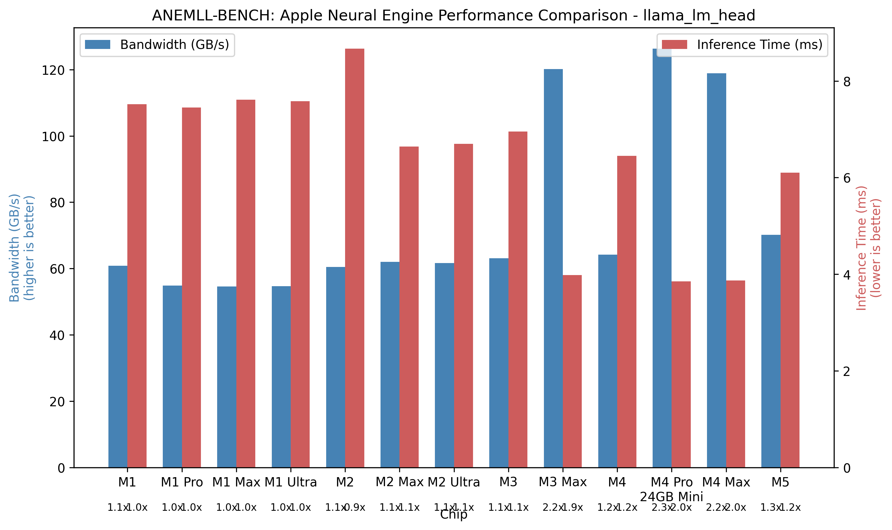

# ANEMLL-Bench Results

This document presents benchmark results for various machine learning models on different Apple Silicon chips, focusing on Neural Engine (ANE) performance.

## ⚠️ ATTENTION: M3 RESULTS NEEDED! ⚠️

**We need benchmark data from M3 series devices!** If you have access to any M3 chip variant (M3, M3 Pro, M3 Max, or M3 Ultra), please consider running the benchmarks and submitting your results. Your contribution will help complete our cross-generation performance analysis.

*Submit results to: [realanemll@gmail.com](mailto:realanemll@gmail.com) or [open an issue](https://github.com/Anemll/anemll-bench/issues/new)*

## Overview

ANEMLL-Bench measures two primary metrics:
1. **Memory Bandwidth (GB/s)**: How Apple Chip Generation utilizes memory bandwidth
2. **Inference Time (ms)**: How quickly the model produces results

Higher memory bandwidth and lower inference time indicate better performance.

## Apple Silicon Performance Comparison

The chart below shows performance comparison across Apple Silicon generations for the `llama_lm_head` model:



As shown in the visualization:
- **M4 Series** chips demonstrate approximately 2.3x higher memory bandwidth compared to M1 series
- **M4 Series** inference times are approximately 2.0x faster than M1 series
- The improvements from M1 to M2 were modest (~1.1x), while M4 represents a significant leap

## Detailed Benchmark Results

### llama_lm_head Model (Standard)

| Chip | Memory Bandwidth (GB/s) | Inference Time (ms) | Bandwidth Factor | Inference Factor |
|------|------------------------|---------------------|------------------|------------------|
| M1 Max | 54.62 | 7.61 | 1.0x | 1.0x |
| M1 Ultra | 54.72 | 7.58 | 1.0x | 1.0x |
| M2 Max | 62.01 | 6.64 | 1.1x | 1.1x |
| M2 Ultra | 61.68 | 6.70 | 1.1x | 1.1x |
| M4 Pro | 126.36 | 3.85 | 2.3x | 2.0x |
| M4 Max | 118.86 | 3.89 | 2.2x | 2.0x |

### Key Observations

1. **Neural Engine Scaling**:
   - The M1 Ultra shows minimal performance gains over M1 Max, suggesting limited Neural Engine scaling in first-generation Apple Silicon
   - Similar pattern with M2 Ultra vs M2 Max
   - M4 series demonstrates better scaling and significantly improved performance

2. **Memory Bandwidth Efficiency**:
   - M4 series shows a ~2.3x improvement in memory bandwidth utilization
   - This indicates substantial architectural improvements in the Neural Engine

3. **Inference Time Improvements**:
   - M4 chips process the same model in approximately half the time compared to M1 chips
   - This translates directly to improved user experience for AI applications

## Running Your Own Benchmarks

To reproduce these results or run benchmarks on your own device:

```bash
# Install dependencies
pip install -r requirements.txt
pip install -e .

# Download optimized models for your macOS version
python examples/sync_models.py

# Run benchmarks on all available models
python examples/benchmark_all_models.py

# Generate visualization of results
python examples/plot_chip_comparison.py --save
```

## Contributing Results

We're building a comprehensive benchmark database across all Apple Silicon variants. Please consider submitting your benchmark results by:

1. Running the benchmarks using the instructions above
2. Opening an issue on our GitHub repository with your results
3. Or emailing your results to realanemll@gmail.com

When submitting results, please include:
- Your exact device model (e.g., "MacBook Pro 14" 2023, M3 Pro 12-core CPU, 18-core GPU")
- macOS version
- Any cooling modifications or environmental factors
- The complete benchmark report

## Analyzing Your Results

When analyzing your benchmark results, consider:

1. **Relative Performance**: How does your chip compare to others in the same family?
2. **Scaling Efficiency**: If you have a Pro/Max/Ultra variant, how efficiently does it scale?
3. **Model-Specific Performance**: Different model architectures may perform differently on the same hardware

## Future Work

We plan to expand our benchmarks to include:
- More diverse model architectures
- Power efficiency measurements (performance per watt)
- Sustained performance under thermal constraints
- Newer versions of CoreML and PyTorch

## Acknowledgements

Thanks to all contributors who have submitted benchmark results and helped improve ANEMLL-Bench. 
